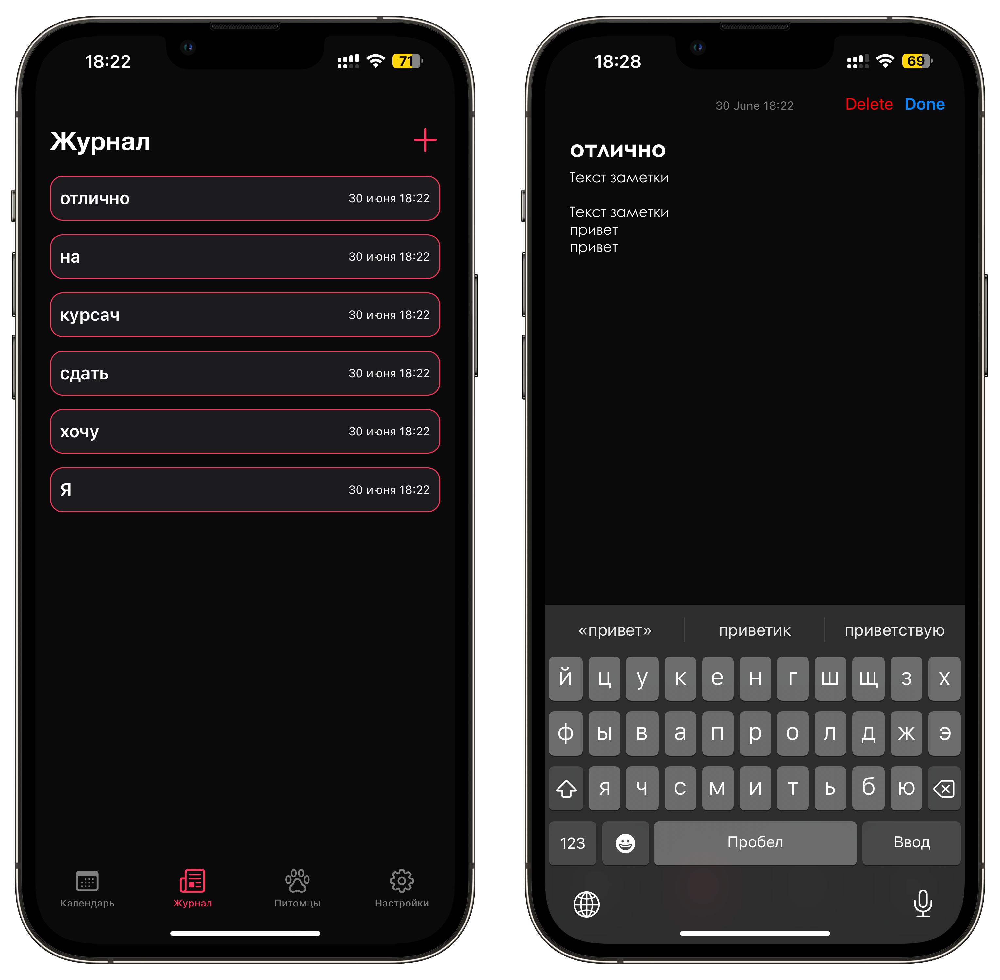

# LovelyPetApp
IOS App with UIKit&Firebase.
## О приложении
«Любимый питомец» создан с целью облегчения процесса ухода за домашними питомцами, в нем заключены следующие основные возможности:
+ Регистрация/автризация
+ Добавление событий/напоминаний
+ Добавление заметок и их редактирование
+ Добавление питомцвев с базовой информацией о них в список с питомцами: 
  + Имя питомца
  + Дата рождения
  + Дата последней привики
  + Дата последнего купания
+ Смена пароля
## Иллюстрация работы приложения:

_Авторизация, темный и светлый фоны, поддержка английского языка_

_Календарь для добавления событий_

_Журнал для заметок_

_Разделы с питомцами_

_Настройки, смена пароля_
